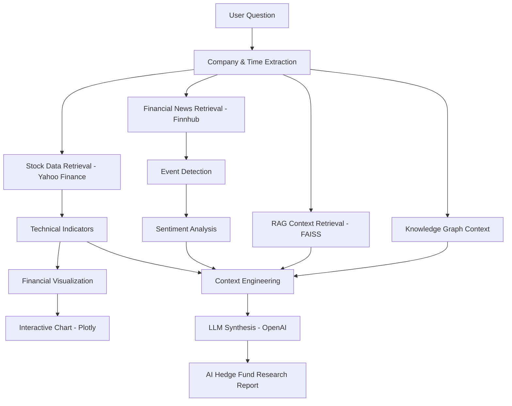
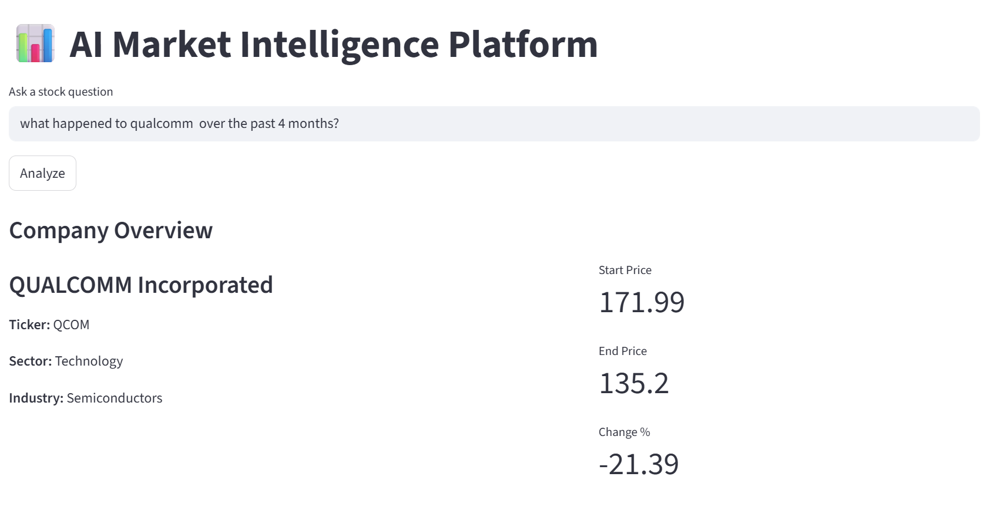
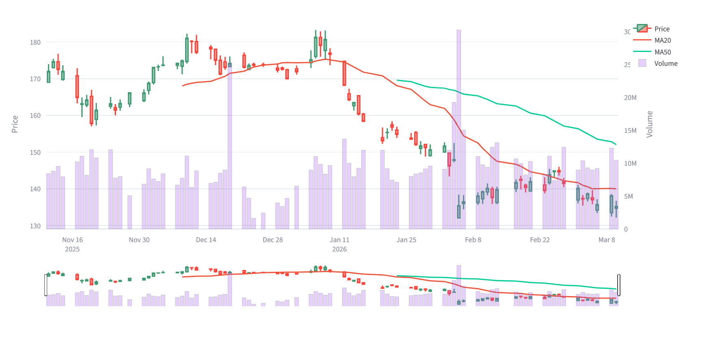
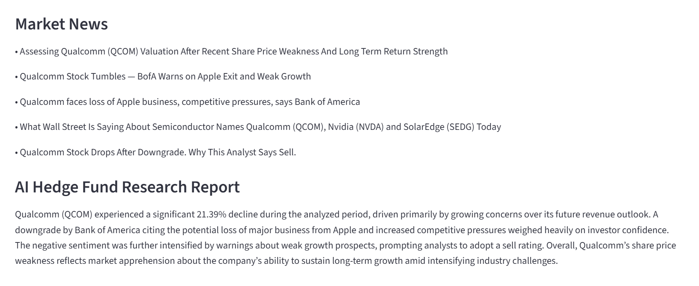

# AI Market Intelligence Platform

## Overview

The **AI Market Intelligence Platform** is an AI-powered financial analytics application that explains **why a stock moved during a specific time period** by combining financial data, market news, vector search, and large language models.

Instead of manually reviewing multiple financial sources, users can ask natural language questions such as:

- "What happened to Bank of America in the last 12 days?"
- "How did Apple perform in the last 3 months?"
- "Why did Tesla stock move last week?"

The platform retrieves stock price data, financial news, historical context, and generates an **AI-powered hedge fund style research explanation**.

---

## Key Features

### Natural Language Stock Analysis
Users can ask questions in natural language and the system automatically identifies:

- Company name
- Stock ticker
- Time range

Example query:

```
What happened to Nvidia in the last 10 days?
```

---

### Financial Market Visualization

The platform generates an interactive financial chart including:

- Candlestick price chart
- Moving averages (MA20, MA50)
- Trading volume

Charts are built using **Plotly** and displayed in **Streamlit**.

---

### Financial News Intelligence

Market news is retrieved using the **Finnhub API** to provide contextual explanations of stock movements.

---

### Retrieval Augmented Generation (RAG)

The system uses **FAISS vector search** to retrieve historical financial context relevant to the user’s question.

---

### Knowledge Graph Context

A lightweight **knowledge graph module** provides structured company context such as sector and industry information.

---

### AI Hedge Fund Research Report

The platform combines:

- Price movements
- Market news
- Sentiment signals
- Historical context
- Knowledge graph insights

to generate a **professional AI-generated research explanation**.

---

# System Architecture (RAG + Financial Analytics Pipeline)

The platform combines **financial data retrieval, contextual intelligence, vector search, and LLM reasoning**.



---

# Key AI Components

### Context Engineering

The system builds structured input for the LLM by combining:

- Stock price analysis
- Financial news
- Historical financial context
- Knowledge graph data
- Market sentiment signals

This structured context improves the quality of AI explanations.

---

### Retrieval Augmented Generation (RAG)

A **FAISS vector database** retrieves relevant historical financial context to augment the AI model’s knowledge.

This enables the model to produce more grounded and informative answers.

---

### Event Detection

The platform detects key market events from news headlines such as:

- Earnings announcements
- Analyst upgrades/downgrades
- Lawsuits
- Acquisitions and mergers

---

### Sentiment Analysis

A lightweight sentiment agent analyzes news headlines to determine whether the overall market tone is **positive, neutral, or negative**.

---

### LLM Synthesis Agent

The synthesis agent combines all signals into a **concise hedge fund style explanation** of the stock movement.

---

# Example Output

## Example Query

"What happened to qualcomm over the past 4 months?"

## Platform Output

The system will:

1. Identify the stock ticker
2. Retrieve stock price data
3. Generate financial charts
4. Retrieve financial news
5. Detect events and sentiment
6. Retrieve historical context via FAISS
7. Generate an AI-powered explanation

---

## Example Screenshots

### Stock Analysis Dashboard



### Financial Chart



### AI Generated Research Report



---

# Tech Stack

- Python
- Streamlit
- Plotly
- LangChain
- OpenAI API
- FAISS (vector search)
- Yahoo Finance API
- Finnhub API
- Pandas
- NumPy
- python-dotenv
- dateparser

---

# Installation

Clone the repository:

```
git clone https://github.com/YOUR_USERNAME/ai-market-intelligence-platform.git
```

Navigate to the project folder:

```
cd ai-market-intelligence-platform
```

Install dependencies:

```
pip install -r requirements.txt
```

---

# API Setup

This project requires API keys.

### OpenAI API

Create a key:

https://platform.openai.com/api-keys

### Finnhub API

Create a key:

https://finnhub.io

Create a `.env` file in the project root:

```
OPENAI_API_KEY=your_openai_api_key
FINNHUB_API_KEY=your_finnhub_api_key
```

---

# Running the Application

Run the Streamlit app:

```
streamlit run app.py
```

Then open the local URL shown in the terminal.

---

# Project Structure

```
ai-market-intelligence-platform
│
├── app.py
├── financial_rag.py
├── knowledge_graph.py
├── requirements.txt
├── README.md
├── .gitignore
├── .env.example
└── screenshots
    ├── screenshot_image1.png
    ├── screenshot_image2.png
    └── screenshot_image3.png
```

---

# Business Value

The AI Market Intelligence Platform helps investors and analysts quickly understand **why a stock moved during a specific period**.

Instead of manually analyzing multiple financial sources, the platform automatically combines:

- Stock price data
- Financial news
- Market events
- Historical financial context
- AI reasoning

This significantly reduces research time and demonstrates how **AI can enhance financial intelligence workflows**.

---

# Author

**Rutunjay Chundur**

Data Analytics professional focused on translating **data into actionable business insights using analytics, AI, and intelligent data systems**.
